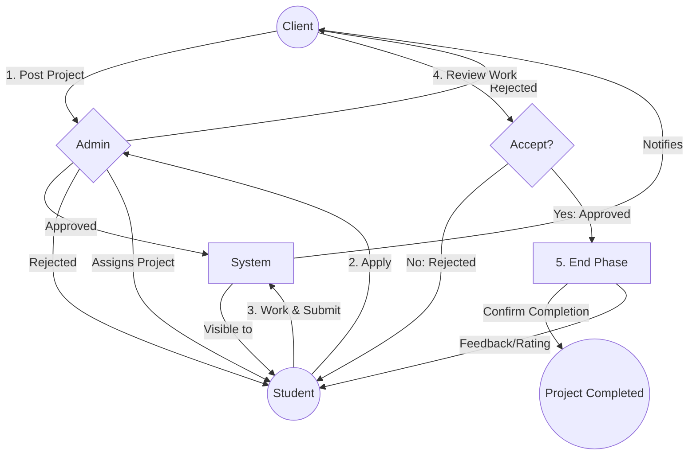

# 🔄 System Flow / Working Mechanism

The **Freelance Project Allocation System** follows a structured workflow involving three primary actors: **Client**, **Student**, and **Admin**. This section explains the end-to-end process, from project posting to final completion, including rejection paths and the specific responsibilities of the client.

---

## 🏗️ 1. Project Initiation & Admin Review
### **Role of Client: Posting the Project**
The lifecycle of a project begins with the **Client**.
1. **Login/Signup**: The client registers on the portal.
2. **Post Project**: The client provides essential details:
   - Project Title & Description
   - Required Skills
   - Budget & Deadline
   - Reference Files (Optional)

### **Admin Review Phase**
Once posted, the project enters a **"Pending Approval"** state.
- **Admin Review**: The Admin checks the project for authenticity and completeness.
- **Outcome A (Approved)**: The project is published and becomes visible to students.
- **Outcome B (Rejected)**:
  - **Rejection Logic**: If the project fails to meet standards or lacks details, the Admin rejects it.
  - **Notification**: The Client is notified with a reason (e.g., "Incomplete Requirements").
  - **Revised Posting**: The Client must update and resubmit the project for review.

---

## 📝 2. Student Application & Selection Phase
### **Student Participation**
1. **View Projects**: Students browse the list of approved projects.
2. **Submit Application**: Interested students apply by providing their portfolio, duration, and proposal.

### **Selection Process**
- **Admin Review**: The Admin evaluates all applications for a specific project.
- **If Rejected**:
  - The student’s application is marked as "Rejected."
  - The student is notified and can apply for other projects.
- **If Approved (Assignment)**:
  - The Admin selects the most suitable student.
  - **1:1 Mapping**: One project is assigned to exactly one student.

---

## ⚙️ 3. Project Execution & Submission
1. **Work Commencement**: The assigned student begins working on the project.
2. **Status Updates**: The student updates the project status as "In Progress."
3. **Submission**: Upon completion, the student uploads the final deliverables to the system.

---

## 🏁 4. Review, Completion & End Portion
### **Role of Client: Final Review & Confirmation**
After the student submits the work, the project moves to the **"Review"** phase.

1. **Client Review**: The client examines the submitted work to ensure it meets the initial requirements.
2. **Outcome A (Rejected by Client)**:
   - **Reason**: The work is incomplete or does not meet quality standards.
   - **Action**: The project is sent back to the student for **Revision**. The student must fix the issues and resubmit.
3. **Outcome B (Approved by Client)**:
   - **Acceptance**: The client marks the work as "Satisfactory."
   - **Status Update**: The project status changes to **"Completed."**

### **Conclusion: Ending the Role of Client**
The system ensures that the Client is the final authority on the quality of work.
- **Completion Confirmation**: The Client clicks on "Confirm Completion."
- **Feedback & Rating**: The Client provides a rating (1-5 stars) and a review for the student’s work.
- **Role End**: The Client's engagement for this specific project concludes, and they can proceed to post new requirements.

---

## 🗺️ 5. System Flowchart (Mermaid Visual)

---

> [!NOTE]
> The **Role of Client** is pivotal as it initiates (by posting) and closes (by approving/rating) the entire project lifecycle.
